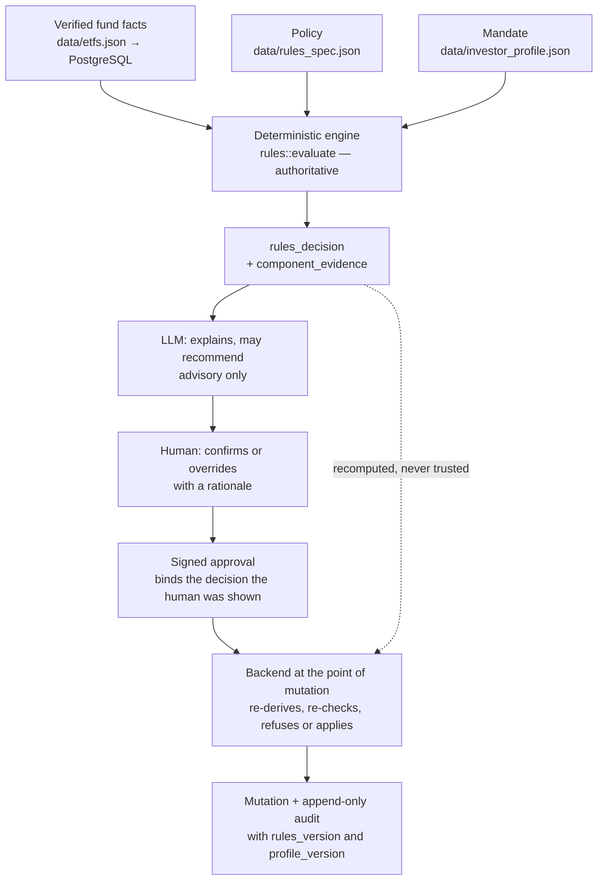

# Applied learning path: from agent to decision system

> [`simple-agent-template`](https://github.com/cognokratos/simple-agent-template)
> teaches how to build a production AI agent.
>
> `etf-research-agent` teaches how to turn that agent into a **governed decision
> system**.

Here the interesting question is no longer *"how does an agent call a tool?"* It
is: who owns the decision, what evidence supports it, what happens when the data
is incomplete, how does a human override it safely, and can we still explain that
decision after the policy changes?

> **A production agent is only part of the system.** In a consequential domain,
> authority, policy, evidence, uncertainty, human consent, auditability and
> evaluation have to be engineered explicitly around it.

## Before you start

This path assumes you have completed, or could teach, the template's
[learning path](https://github.com/cognokratos/simple-agent-template/blob/main/docs/LEARNING-PATH.md):
the model as a probabilistic component, agent loops, tool calling, MCP as a
capability boundary, grounding, guardrails, evaluation, tracing, identity, signed
approvals. None of that is re-taught here. Where a lesson depends on one of those
concepts it links to it, and the link is the prerequisite.

If you have not done the template path, start there. If you only want to run the
ETF application, the [README](../README.md#start) and [DEMO.md](DEMO.md) are the
right entry points, not this page.

The domain is ETF research, and it is used as a **consequential domain to engineer
in**, not as financial content. The system ends at decision support: no brokerage,
no orders, no forecast. A score is a policy and fit evaluation of a dated data
snapshot against a written mandate. Nothing in this curriculum is an investment
recommendation, and every example is about software and system design.

## The path at a glance

| Stage | Applied question | Main idea | Failure it prevents | Lesson |
| --- | --- | --- | --- | --- |
| A1 | What belongs in deterministic policy? | Policy as executable, versioned data | The model, or a code edit nobody reviewed as policy, deciding the outcome | [01 — Policy is a program](applied/01-policy-is-a-program.md) |
| A2 | What does incomplete evidence mean? | Missing data, renormalisation and caps | A score that claims a measurement nobody made | [02 — Uncertainty is policy](applied/02-uncertainty-is-policy.md) |
| A3 | What evidence must the model receive? | Evidence contracts for explanation | Correct decisions explained wrongly | [03 — Design evidence for the model](applied/03-design-evidence-for-the-model.md) |
| A4 | What exactly is the domain entity? | Fund identity versus listing identity | Double counting in rankings; mutations on a guessed record | [04 — Model the domain before the agent](applied/04-model-the-domain-before-the-agent.md) |
| A5 | Who recommends, decides and authorizes? | Rules versus model versus human | The model's opinion, or the model's *claim*, becoming the decision | [05 — Recommendation, authority and consent](applied/05-recommendation-authority-and-consent.md) |
| A6 | How do we prove and preserve decisions? | Evaluation, provenance and policy-versioned audit | Green dashboards over wrong answers; audit rows nobody can interpret | [06 — Decisions that survive policy change](applied/06-decisions-that-survive-policy-change.md), [07 — Evaluate the system](applied/07-evaluate-the-system-not-just-the-model.md) |

Cross-cutting, linked from the stages that need it:

* [08 — Adversarial domain data and authority classes](applied/08-adversarial-domain-data.md),
  after A3 and A5;
* [Follow one decision](applied/DECISION-WALKTHROUGH.md), the applied counterpart
  of the template's request walkthrough — read it after A1 or at the end;
* [Case studies](applied/CASE-STUDIES.md), the real incidents the lessons are
  built from;
* [Challenges](applied/CHALLENGES.md), competency exercises with no solutions.

The diagram the whole path elaborates:

Authority enters at the top as data, is computed once by code, passes *through*
the model without being owned by it, is consented to by a person, and is
re-derived by the backend before anything persists. Every lesson is about one
edge of that graph.

## How long things take

| In | You can | Read |
| --- | --- | --- |
| 10 minutes | Say how this repository differs from the template, and where authority lives | This page, [the walkthrough's summary table](applied/DECISION-WALKTHROUGH.md#authority-at-a-glance) |
| 45 minutes | Trace one decision from fund facts to an audit row | [Follow one decision](applied/DECISION-WALKTHROUGH.md) |
| An afternoon | Do the labs in A1–A4; almost all of them need no cluster and no model | Lessons [01](applied/01-policy-is-a-program.md)–[04](applied/04-model-the-domain-before-the-agent.md) with `make rules-explain` |
| A day | Run the live experiments in A5–A6 and lesson 08 | A running cluster and a model; [README](../README.md#start) |
| Open-ended | Port the architecture to another consequential domain | [Challenges](applied/CHALLENGES.md) |

Every deterministic lab runs with `python3` and `cargo` only. `make rules-explain`
prints one fund's evaluation exactly as the engine and the read models produce it,
and accepts in-memory overrides of the scored facts, so most experiments never
touch `data/` at all.

---

## Stage A1: Policy is a program

**Question.** If a decision can be specified, where should the specification live?

**Main idea.** As reviewable, versioned, validated data, interpreted by generic
code. `rules.rs` defines *how* policy is interpreted; `rules_spec.json` and
`investor_profile.json` determine *what* the decision is.

**In this repository.** [`data/rules_spec.json`](../data/rules_spec.json),
[`data/investor_profile.json`](../data/investor_profile.json),
`RulesSpec::validate` and `rules::evaluate` in
[`mcp-server/src/rules.rs`](../mcp-server/src/rules.rs).

**Failure it prevents.** A threshold buried in code that nobody reviews as policy;
an invalid policy that silently rescored the universe instead of refusing to boot.

**Experiment.** Change a cost band and watch five funds move with every test still
green; break the specification and see which validator catches each break.

**Prerequisite.** Template [Stage 0 and the split it ends on](https://github.com/cognokratos/simple-agent-template/blob/main/docs/LEARNING-PATH.md#the-path-at-a-glance),
and [overusing agents for deterministic workflows](https://github.com/cognokratos/simple-agent-template/blob/main/docs/concepts/ANTI-PATTERNS.md#overusing-agents-for-deterministic-workflows).

**Reference.** [ARCHITECTURE.md — policy is data, not code](ARCHITECTURE.md#policy-is-data-not-code)

## Stage A2: Uncertainty is policy

**Question.** Grounded data can still be incomplete. What does "unknown" mean for a
decision?

**Main idea.** Absence is neither zero nor nothing. Absent weight leaves the
denominator, the absence is published with the weight it removed, and caps exist
because renormalisation flatters exactly the records it helps.

**In this repository.** `missing_data_policy` and `decision_caps` in the
specification; the `Normalization` and `ComponentBreakdown` types in `rules.rs`.
`AGGH-XETRA` is the shipped example: 84 renormalised, held at `research`.

**Failure it prevents.** "We measured it and it was bad" said about a fund nobody
measured; scores that look comparable and are not.

**Experiment.** Remove metrics from a fund in memory, predict the denominator and
the factor, then compare with what the engine returns — and with what the two
naïve designs would have claimed.

**Prerequisite.** Template [Stage 4 — grounding](https://github.com/cognokratos/simple-agent-template/blob/main/docs/LEARNING-PATH.md#stage-4-grounding-in-authoritative-systems).

**Reference.** [ARCHITECTURE.md — missing data is a policy](ARCHITECTURE.md#missing-data-is-a-policy-not-an-accident)

## Stage A3: Design evidence for the model

**Question.** The backend's answer is right. What must the model receive to explain
it right?

**Main idea.** Tool design is information architecture for a probabilistic
consumer. A relationship the contract does not make explicit is a relationship the
model will eventually drop or invert.

**In this repository.** `component_evidence` in
[`mcp-server/src/domain.rs`](../mcp-server/src/domain.rs) and
`RESEARCH_CONTEXT_REQUIRED_ELEMENTS` in
[`mcp-server/src/server.rs`](../mcp-server/src/server.rs).

**Failure it prevents.** The IEAC-LSE regression: the explanation stopped naming
"bond", then named it with the direction inverted. Both with the correct decision.

**Experiment.** Build three progressively richer payloads from the engine's real
output and see what each one makes it *possible* to explain.

**Prerequisite.** Template [concept 2 — when agent problems are API-design problems](https://github.com/cognokratos/simple-agent-template/blob/main/docs/concepts/02-tools-and-mcp.md#when-agent-problems-are-api-design-problems).

**Reference.** [EVALUATION_ANALYSIS.md — the explanation lost its facts](EVALUATION_ANALYSIS.md#the-explanation-lost-its-facts-and-how-the-tool-contract-got-them-back)

## Stage A4: Model the domain before the agent

**Question.** What is the thing being decided about?

**Main idea.** Fund identity (ISIN) and listing identity (ticker + venue) are
different entities, and the right one depends on the operation. Aggregation may
collapse identities; mutation must resolve one canonical resource.

**In this repository.** `fund_identity()` in `domain.rs`, `collapse_listings` and
`resolve` in `server.rs`, the cross-listing check in
[`scripts/validate_etf_fixtures.py`](../scripts/validate_etf_fixtures.py).

**Failure it prevents.** One fund taking two slots in a top five; a mutation landing
on a listing the system guessed.

**Experiment.** Rank United States shortlist candidates with and without listing
collapse; resolve `VUSA` and see why a ranking may group it and a mutation may not.

**Prerequisite.** Template [Stage 3 — capability boundaries](https://github.com/cognokratos/simple-agent-template/blob/main/docs/LEARNING-PATH.md#stage-3-mcp-and-capability-boundaries).

**Reference.** [ARCHITECTURE.md — listing identity versus fund identity](ARCHITECTURE.md#listing-identity-versus-fund-identity)

## Stage A5: Recommendation, authority and consent

**Question.** The engine computes, the model recommends, the human chooses. Which
of those is the decision, and who can change it?

**Main idea.** `rules_decision`, `llm_recommendation`, the human's choice and the
persisted `final_decision` are four separate values with four separate owners. The
backend re-derives the authoritative one at the point of mutation and never trusts
anybody's *claim* about it — including a claim the human approved.

**In this repository.** `rules::reconcile_decision`, `blocking_hard_constraint`,
`compare_recommendation`; the commit path in `server.rs`; the approval prompt in
[`approval.py`](../agent/src/nat_streaming_react/approval.py).

**Failure it prevents.** The model holding the default in the conservative
direction; a model misreporting the engine to get a promotion past a human.

**Experiment.** Walk the trust matrix through `reconcile_decision`; trace the
observed case where the model told a human that a rejected fund's engine decision
was `shortlist`.

**Prerequisite.** Template [Stage 9 — human-in-the-loop mutation](https://github.com/cognokratos/simple-agent-template/blob/main/docs/LEARNING-PATH.md#stage-9-human-in-the-loop-and-controlled-mutations).
Token mechanics are not re-taught.

**Reference.** [ARCHITECTURE.md — who holds the default decision](ARCHITECTURE.md#who-holds-the-default-decision),
[APPROVALS.md](APPROVALS.md)

Then: [08 — adversarial domain data](applied/08-adversarial-domain-data.md), which
asks the same authority question about text instead of actors.

## Stage A6: Prove and preserve decisions

**Question.** How do you show the system decides correctly, and how does a decision
stay interpretable after the policy moves?

**Main idea.** Two halves. *Preservation*: a historical decision is only
interpretable with the policy and mandate generation it was made under, so the
audit record carries both and never merges generations. *Proof*: separate
deterministic claims from model-dependent ones from presentation signals, and give
each metric a maturity — gate, diagnostic, experimental — that matches what it can
actually prove.

**In this repository.** `decided_rules_version` / `decided_profile_version`,
`policy_generations` in `domain.rs`, `audit_events` in
[`db/init.sql`](../db/init.sql); the five suites in
[`evaluation/scorers.py`](../evaluation/scorers.py) and the deterministic baseline
emitted by `make rules-test`.

**Failure it prevents.** An assignment event presenting a v1 score under a v2
version; a 100× expense-ratio error shipping under green gates.

**Experiment.** Commit a decision, change the mandate, assign the fund, and read the
two generations apart. Then take the TER, IEAC and policy-0.4 incidents and say, for
each, what the evaluation proved and what it did not.

**Prerequisite.** Template [Stage 6 — evaluation](https://github.com/cognokratos/simple-agent-template/blob/main/docs/LEARNING-PATH.md#stage-6-evaluation)
and [concept 3 — current state versus history](https://github.com/cognokratos/simple-agent-template/blob/main/docs/concepts/03-grounding-and-authoritative-state.md#current-state-versus-history).

**Reference.** [ARCHITECTURE.md — audit events are one snapshot](ARCHITECTURE.md#audit-events-are-one-snapshot-or-none),
[EVALUATION.md](EVALUATION.md), [EVALUATION_ANALYSIS.md](EVALUATION_ANALYSIS.md)

---

## What this path deliberately does not teach

| Topic | Where it is taught |
| --- | --- |
| Agent loops, ReAct, native tool calling | Template stages [1](https://github.com/cognokratos/simple-agent-template/blob/main/docs/LEARNING-PATH.md#stage-1-agent-and-agent-loop)–[2](https://github.com/cognokratos/simple-agent-template/blob/main/docs/LEARNING-PATH.md#stage-2-tool-calling) |
| MCP, the tool list as the capability boundary | Template [stage 3](https://github.com/cognokratos/simple-agent-template/blob/main/docs/LEARNING-PATH.md#stage-3-mcp-and-capability-boundaries) |
| Grounding basics; grounded is not correct | Template [concept 3](https://github.com/cognokratos/simple-agent-template/blob/main/docs/concepts/03-grounding-and-authoritative-state.md) |
| Input/output rails, data-plane injection basics | Template [concept 4](https://github.com/cognokratos/simple-agent-template/blob/main/docs/concepts/04-guardrails-and-deterministic-controls.md) |
| Deterministic scorers, evaluation methodology | Template [concept 5](https://github.com/cognokratos/simple-agent-template/blob/main/docs/concepts/05-evaluation.md) |
| Tracing and the trace pipeline | Template [concept 6](https://github.com/cognokratos/simple-agent-template/blob/main/docs/concepts/06-observability.md), [OBSERVABILITY.md](OBSERVABILITY.md) |
| Gateway, OIDC, service credentials, networks | Template [concept 7](https://github.com/cognokratos/simple-agent-template/blob/main/docs/concepts/07-security-and-trust-boundaries.md), [SECURITY.md](SECURITY.md) |
| Approval tokens, nonces, the interaction guard | Template [concept 8](https://github.com/cognokratos/simple-agent-template/blob/main/docs/concepts/08-human-in-the-loop.md), [APPROVALS.md](APPROVALS.md) |
| The network path of one request | Template [request walkthrough](https://github.com/cognokratos/simple-agent-template/blob/main/docs/tutorials/REQUEST-WALKTHROUGH.md) |

## How to read the claims in these lessons

The same rule as the reference documentation:

> Implementation and executable verification are authoritative. Reference
> documentation is the canonical description. These lessons explain why and guide
> experiments.

If a lesson and the code disagree, the code is right and the lesson is a bug.
`make docs-check` keeps the links, anchors and `make` targets honest; it cannot
check that prose is true.

Two kinds of statement appear, and they are never mixed:

* **Guaranteed** — a property of deterministic code, asserted by `make rules-test`,
  `make etf-check`, `make verify-approvals` or `make verify-approvals-rust`. A
  failure is a defect.
* **Observed** — a behaviour of `qwen3:8b`, on a named build and date, in a stated
  number of runs. It can differ on your machine, your model or tomorrow, and
  finding out is part of the exercise. Observations are never promoted into
  architecture guarantees.

Numbers quoted from the engine (scores, weights, factors) come from the shipped
fixtures — rules `1.1.0`, profile `1.0.0` — and `make rules-explain` reproduces
every one of them.
