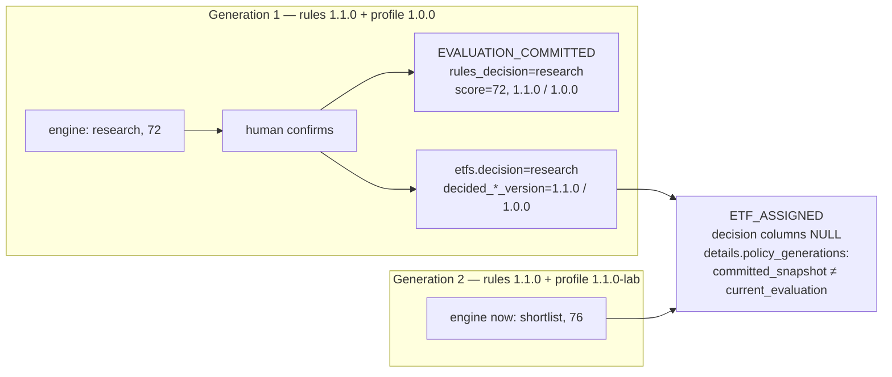

# 6. Decisions must survive policy change

Stage A6 of the [applied learning path](../APPLIED-LEARNING-PATH.md#stage-a6-prove-and-preserve-decisions).
Prerequisite: template concept 3 —
[current state versus history](https://github.com/cognokratos/simple-agent-template/blob/main/docs/concepts/03-grounding-and-authoritative-state.md#current-state-versus-history)
and [state mutation without auditability](https://github.com/cognokratos/simple-agent-template/blob/main/docs/concepts/ANTI-PATTERNS.md#state-mutation-without-auditability).

> **Auditability is not recording what happened. It is recording enough context to
> explain why it was valid at the time.**

The template teaches append-only audit and the split between current state and
history. A decision system adds a dimension the ticket domain does not have: the
*rules that produced* a decision change over time, independently of the record the
decision was about. A historical decision is only interpretable if you know the
policy and the mandate it was made under — and an audit design that cannot keep
those apart will eventually present a decision nobody made.

## Two generations side by side



Three rules make that diagram hold, all in this repository:

1. **The current result is never stored.** It is recomputed from the rules, the
   profile and the row on every read. An earlier revision stored the engine's score
   at seed time so SQL could sort on it; it went stale on the first policy edit,
   because nothing reseeds when policy changes
   ([ARCHITECTURE.md](../ARCHITECTURE.md#what-is-stored-and-what-is-recomputed)).
2. **The committed result names its generation.** `apply_evaluation` and
   `apply_shortlist` in [`store.rs`](../../mcp-server/src/store.rs) write
   `decided_rules_version` and `decided_profile_version` in the same statement as
   the decision and score; every `audit_events` row that describes an evaluation
   carries `rules_version` and `profile_version`.
3. **A row describes one generation, or none.** The decision columns of
   `audit_events` — `rules_decision`, `llm_recommendation`, `final_decision`,
   `investment_score`, `rules_version`, `profile_version` — are one coherent
   snapshot or all null. An event that creates no decision leaves them null and
   records both generations, separately, under `details.policy_generations`
   (`policy_generations` in [`domain.rs`](../../mcp-server/src/domain.rs)).

Rule 3 exists because it was broken. The assignment path used to recompute the
current evaluation, write the *current* versions, and alongside them the
*committed* score:

```text
investment_score: 84     <- earned under rules v1
rules_version:    2.0.0  <- in force at assignment time
```

One row, two policies, and nothing on it says so
([ARCHITECTURE.md](../ARCHITECTURE.md#audit-events-are-one-snapshot-or-none)).

## The bad audit record

Compare what each record lets a reviewer answer a year later:

| Question | `"ETF X was shortlisted"` | This repository's `EVALUATION_COMMITTED` row |
| --- | --- | --- |
| Who decided? | — | `actor_type`, `actor_id` (gateway-asserted, never model-supplied) |
| Under which policy and mandate? | — | `rules_version`, `profile_version` |
| What did the engine say? | — | `rules_decision`, `investment_score`, `details.score_decision`, `details.applied_caps` |
| What did the model recommend? | — | `llm_recommendation` |
| Did the human depart from the engine? Why? | — | `override_applied`, `override_rationale` |
| Which authenticated request, which approval? | — | `request_id`, `details.approval_nonce` |
| Can it be edited afterwards? | — | no: `audit_events_append_only` trigger in [`db/init.sql`](../../db/init.sql) |

The left column records *what happened*. Only the right one lets you say *why it
was valid at the time* — and therefore whether it is still valid now.

## Lab

This lab needs a running cluster and a model, and it mutates `VJPN-LSE`, one of
the funds `make verify-approvals` resets. Budget twenty minutes.

### 1. Start from a clean record

```bash
docker compose exec -T postgres psql -q -U etf_research -d etf_research -c \
  "UPDATE etfs SET review_state='UNREVIEWED', decision=NULL, investment_score=NULL,
   decided_rules_version=NULL, decided_profile_version=NULL, assigned_to=NULL,
   research_note=NULL, updated_at=NOW() WHERE etf_id='VJPN-LSE';"
```

That is the same reset the Makefile applies before `verify-approvals`. It does not
touch `audit_events`, and could not: the trigger refuses.

### 2. Commit a decision under the shipped policy

In the UI:

```text
Commit a review decision for VJPN-LSE.
```

The engine returns `research` at 72. Confirm it — no rationale is needed, because
nothing is being overridden. Then:

```bash
docker compose exec -T postgres psql -U etf_research -d etf_research -c \
  "SELECT review_state, decision, investment_score, decided_rules_version,
          decided_profile_version FROM etfs WHERE etf_id='VJPN-LSE';"
```

Expect `RESEARCH | research | 72 | 1.1.0 | 1.0.0`.

### 3. Change the mandate

> Requires a clean worktree; the restore command discards local edits in these paths. See the [ground rules](README.md#ground-rules-for-the-labs).

In `data/investor_profile.json`, set `"accumulating": false` under `preferences`
and change `version` to `"1.1.0-lab"`. `VJPN-LSE` is a distributing share class,
so this preference was costing it. Apply it — no rebuild, `data/` is mounted
read-only and read at boot:

```bash
docker compose restart mcp-server agent
```

You can predict the effect offline first: `make rules-explain ETF=VJPN-LSE` now
reports 76 and `shortlist`, under profile `1.1.0-lab`.

### 4. Read the current state against the committed one

```text
Show me VJPN-LSE: its current evaluation, and the decision we committed for it.
```

The `get_etf` result carries both. `current_evaluation` says `shortlist`, 76,
profile `1.1.0-lab`; `workflow.committed_snapshot` says `research`, 72, profile
`1.0.0`, with a note saying never to compare the two without checking the
versions. Both are true. They answer different questions.

Whether the agent *explains* that difference well is model behaviour; that the
data keeps them apart is not.

### 5. Read the history

```bash
docker compose exec -T postgres psql -U etf_research -d etf_research -c \
  "SELECT id, action, actor_type, rules_decision, final_decision, investment_score,
          rules_version, profile_version
   FROM audit_events WHERE etf_id='VJPN-LSE' ORDER BY id;"
```

Every `ETF_EVALUATED` row (the read-only evaluations) and the
`EVALUATION_COMMITTED` row carry the generation that produced them. The rows
before the restart say `1.0.0`; the ones after say `1.1.0-lab`.

### 6. Assign the fund after the policy moved

```text
Assign VJPN-LSE to Alex for further research.
```

Approve it, then:

```bash
docker compose exec -T postgres psql -U etf_research -d etf_research -c \
  "SELECT rules_decision, final_decision, investment_score, rules_version,
          jsonb_pretty(details -> 'policy_generations')
   FROM audit_events WHERE etf_id='VJPN-LSE' AND action='ETF_ASSIGNED';"
```

The decision columns are null. Under `policy_generations`, `committed_snapshot`
holds `research`, 72, `1.1.0` / `1.0.0`, and `current_evaluation` holds `shortlist`,
76, `1.1.0` / `1.1.0-lab`. The assignment did not restate a decision under the
new policy, and it did not quietly carry the old one forward under new version
numbers.

**Which policy explains the original decision?** Answer from the rows alone, then
check your answer against the `EVALUATION_COMMITTED` row.

### 7. Restore

```bash
git checkout -- data/
docker compose restart mcp-server agent
```

`VJPN-LSE` stays `ASSIGNED` until `make verify-approvals` or the reset in step 1
puts it back. Its history stays forever.

### Offline equivalent

`a_non_decision_event_keeps_the_two_policy_generations_apart` in
[`domain/tests.rs`](../../mcp-server/src/domain/tests.rs) does steps 2–6 with no
cluster: it commits under the shipped rules, moves the rules version and the
scoring, and asserts that the two generations stay separate objects with no
flattened field a reader could mistake for one snapshot.

```bash
cd mcp-server && cargo test policy_generations_apart
```

## Two things the versions do not cover

**A version is a claim, not a fact.** `rules_version` is a string someone types.
In lesson [01](01-policy-is-a-program.md#2-change-a-band-on-purpose) you moved a
cost band and five scores without touching `"version": "1.1.0"`. Nothing in the
repository refuses that: committed decisions under the edited policy would name
the same version as decisions under the original. The baseline artifact records
the SHA-256 of every fixture; the audit trail does not.

**Policy and mandate are two of three generations.** The engine's inputs are the
rules, the profile *and the fund facts*. `etfs.json` is a dated snapshot
(`data_as_of`), and when it is refreshed, a decision committed under rules
`1.1.0` and profile `1.0.0` may have been made on different facts from today's.
The `EVALUATION_COMMITTED` row records the score and caps that resulted, not the
facts or the snapshot date they came from.

**Question.** What is the smallest change that would make every committed decision
reproducible bit-for-bit — and what would it cost in storage, in schema, and in
what a reviewer has to read? Both gaps are open; see
[CHALLENGES.md](CHALLENGES.md#open-problems).

## What to take away

* Store the committed decision; recompute the current one. Never store a derived
  value whose inputs can change without the stored value knowing.
* A decision row is one coherent snapshot of one generation, or it carries no
  decision at all. Events that span generations record each one separately.
* "Was this decision valid?" is a question about the past, answered from the
  generation it names — not from what the engine says today.
* A version string is only as trustworthy as the process that bumps it. Where it
  matters, identify a generation by content, not by label.

## Go deeper

* Reference: [ARCHITECTURE.md — what is stored, and what is recomputed](../ARCHITECTURE.md#what-is-stored-and-what-is-recomputed),
  [audit events are one snapshot, or none](../ARCHITECTURE.md#audit-events-are-one-snapshot-or-none),
  [APPROVALS.md — the audit trail](../APPROVALS.md#the-audit-trail),
  [DEMO.md — an assignment after the fact](../DEMO.md#an-assignment-after-the-fact)
* Source: `committed_snapshot` and `policy_generations` in
  [`domain.rs`](../../mcp-server/src/domain.rs); `apply_evaluation` and
  `write_audit` in [`store.rs`](../../mcp-server/src/store.rs); `assign_etf` in
  [`server.rs`](../../mcp-server/src/server.rs)
* Next: [07 — Evaluate the system, not just the model](07-evaluate-the-system-not-just-the-model.md)
